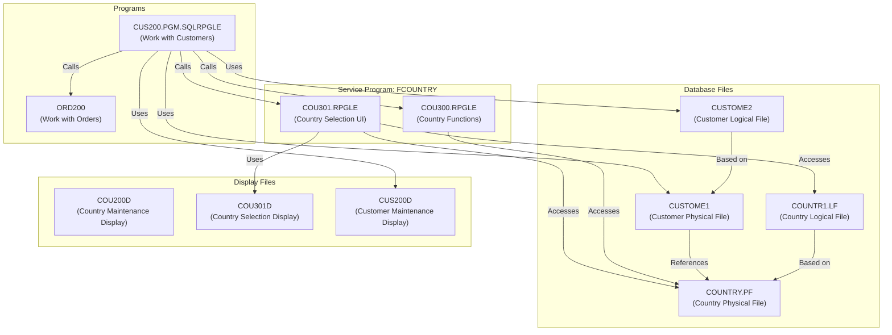

# IBM i Application Architecture Summary

## Overview

This IBM i (AS/400) application is a customer management system with country reference data. The application follows a traditional IBM i architecture with physical files (tables), logical files (views/indexes), RPG modules, and service programs.

## Database Structure

### Country Data

1. **COUNTRY.PF (Physical File)**
   - Record format: FCOUN
   - Fields:
     - COID: Country ID (key field)
     - COUNTR: Country name
     - COISO: 3-character ISO country code

2. **COUNTR1.LF (Logical File)**
   - Based on COUNTRY.PF
   - Provides an alternate access path to the country data
   - Keyed by COUNTR (country name) instead of COID
   - Allows accessing countries sorted by name rather than ID

### Country Data Management

The application includes a display file (COU200D.DSPF) for maintaining country data, suggesting there might be a corresponding program (COU200) that wasn't found in the workspace. This display file includes:

1. A subfile to list countries with their codes and ISO codes
2. A format for editing country details

### Customer Data

The customer files (CUSTOME1 and CUSTOME2) are referenced in the code but not available in the workspace. Based on the code, we can infer:

- Customer data includes fields like:
  - CUID: Customer ID
  - CUSTNM: Customer name
  - CUPHONE: Customer phone number
  - CUCOUN: Country code (references COUNTRY.PF)
  - CULASTORD: Date of last order
  - CUMOD: Last modification timestamp
  - CUMODID: User who last modified the record
  - CUCREA: Creation date

## Service Modules

### FCOUNTRY Service Program

The FCOUNTRY service program is built from two modules:

1. **COU300.RPGLE**
   - A service module that provides utility functions for working with country data
   - Exported procedures:
     - `GetCountryName`: Returns the country name for a given country ID
     - `GetCountryIso3`: Returns the ISO-3 code for a given country ID
     - `ExistCountry`: Checks if a country with the given ID exists
   - Internal procedures:
     - `chainCOUNTRY`: Reads a record from the COUNTRY file
     - `closeCOUNTRY`: Closes the COUNTRY file

2. **COU301.RPGLE**
   - A service module that provides a user interface for selecting a country
   - Exported procedure:
     - `sltcountry`: Displays a subfile with country codes and names, allowing the user to select one
   - Uses both COUNTRY.PF and COUNTR1.LF to allow sorting by code or name
   - Uses a display file (COU301D) for the user interface

## Main Program

**CUS200.PGM.SQLRPGLE**
- A program for working with customer data ("Work with Customers")
- Uses:
  - CUSTOME2 and CUSTOME1 files for customer data
  - CUS200D display file for the user interface
  - The COUNTRY service program for country-related functions
- Has two panels:
  - Panel 1: A subfile to list and select customers
  - Panel 2: A form to create or update customer details
- Features:
  - Create new customers
  - Update existing customers
  - View customer orders (calls ORD200 program)
  - Validates country codes using the FCOUNTRY service program
  - Uses SQL for some operations (e.g., sequence for customer ID, duplicate checking)

## Architecture Diagram

## Program Flow

### CUS200.PGM.SQLRPGLE (Work with Customers)

1. **Panel 1: Customer List**
   - Displays a list of customers
   - Allows selecting a customer for update (option 2)
   - Allows viewing customer orders (option 5)
   - Allows creating a new customer (F6)

2. **Panel 2: Customer Maintenance**
   - Displays customer details for creation or update
   - Validates input:
     - Country code must exist (using ExistCountry)
     - Customer name is required
     - Phone number is required and must contain only digits
     - Checks for duplicates based on name and phone
   - Allows selecting a country using F4 (calls sltcountry)
   - Updates or creates customer record

### COU301.RPGLE (Country Selection)

1. **Country Selection Screen**
   - Displays a list of countries with codes and names
   - Allows toggling between sorting by code and by name (F8)
   - Allows selecting a country (option 1)
   - Returns the selected country code to the calling program

## Conclusion

This is a traditional IBM i application with a clear separation between data access (physical and logical files), business logic (service modules), and user interface (display files and programs). The modular design with service programs allows for code reuse across the application.