# Used Car Lot Application Architecture

This document provides a comprehensive overview of the Used Car Lot application architecture, including data architecture, layered architecture, and integration patterns.

## 1. System Overview

The Used Car Lot application is a hybrid system that combines traditional IBM i (AS/400) components with a modern web interface. The system is designed to manage vehicle inventory, track sales, and provide business analytics for a used car dealership.

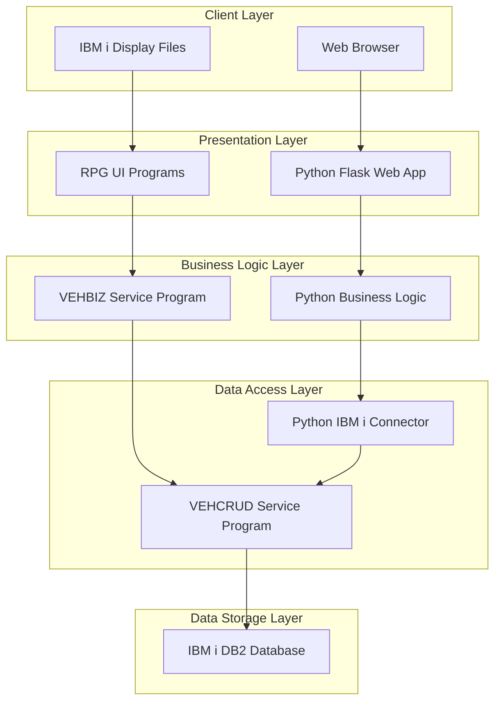

The system architecture follows a multi-layered approach with two distinct user interfaces:
1. Traditional IBM i green-screen interface using display files and RPG programs
2. Modern web interface using Python Flask with responsive design

Both interfaces interact with the same backend services and database, ensuring data consistency across the system.

## 2. Data Architecture

### 2.1 Database Schema

The application uses IBM i DB2 database with two primary tables:

```mermaid
erDiagram
    VEHICLES {
        int VEHICLE_ID PK
        varchar(50) MAKE
        varchar(50) MODEL
        varchar(50) TRIM
        int YEAR
        varchar(17) VIN
        varchar(30) COLOR
        int ODOMETER
        int CONDITION_RATING
        decimal(10,2) ACQUISITION_PRICE
        decimal(10) ASKING_PRICE
        date DATE_ACQUIRED
        date DATE_SOLD
        varchar(10) STATUS
        varchar(1000) NOTES
        timestamp LAST_UPDATED
    }
    
    VEHICLE_HISTORY {
        int HISTORY_ID PK
        int VEHICLE_ID FK
        varchar(20) EVENT_TYPE
        timestamp EVENT_DATE
        varchar(10) OLD_STATUS
        varchar(10) NEW_STATUS
        decimal(10) OLD_PRICE
        decimal(10) NEW_PRICE
        varchar(10) USER_ID
        varchar(1000) NOTES
    }
    
    VEHICLES ||--o{ VEHICLE_HISTORY : "has"
```

#### Key Database Design Features:
- **VEHICLES table**: Stores all vehicle information including inventory status
- **VEHICLE_HISTORY table**: Tracks all changes to vehicles for audit and analysis
- **Referential Integrity**: Foreign key constraints ensure data consistency
- **Indexes**: Strategic indexes on frequently queried fields for performance

### 2.2 Data Flow Architecture

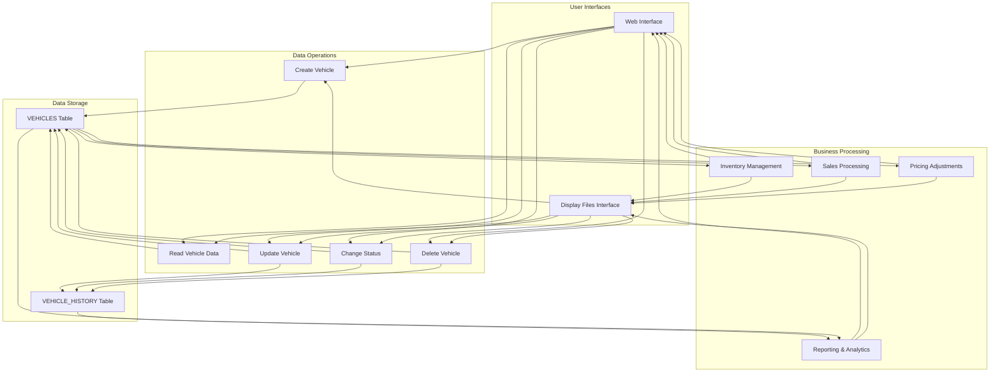

## 3. Layered Architecture

### 3.1 Data Access Layer

The Data Access Layer provides a clean separation between the database and business logic.

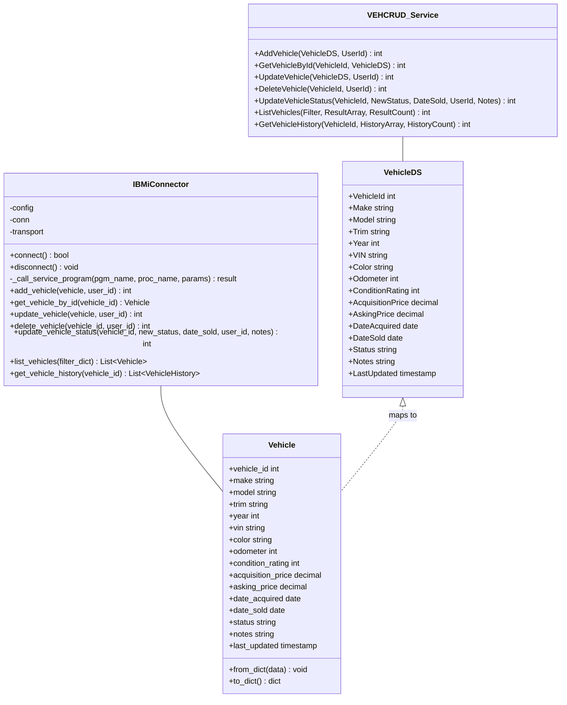

#### Zoom-in: Data Access Layer Implementation

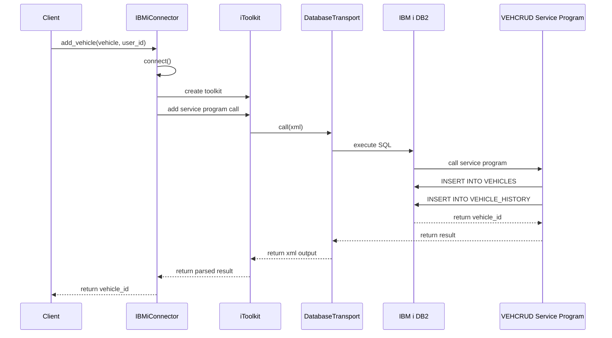

### 3.2 Business Logic Layer

The Business Logic Layer implements domain-specific rules and calculations.

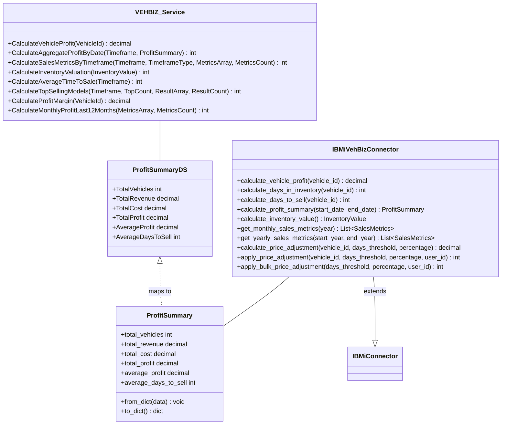

#### Zoom-in: Business Logic Implementation

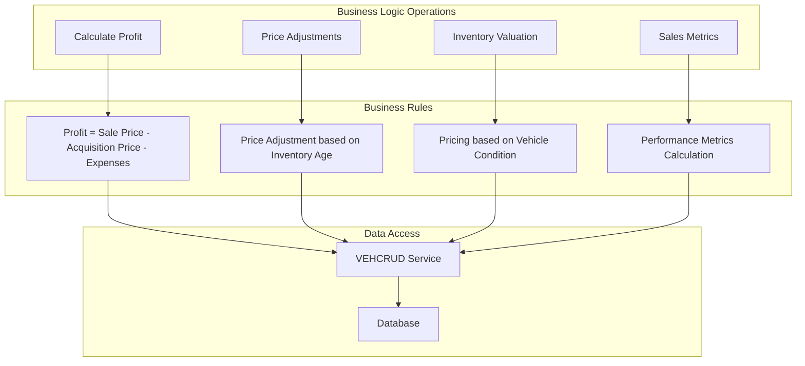

### 3.3 Presentation Layer

The Presentation Layer provides user interfaces for interacting with the system.

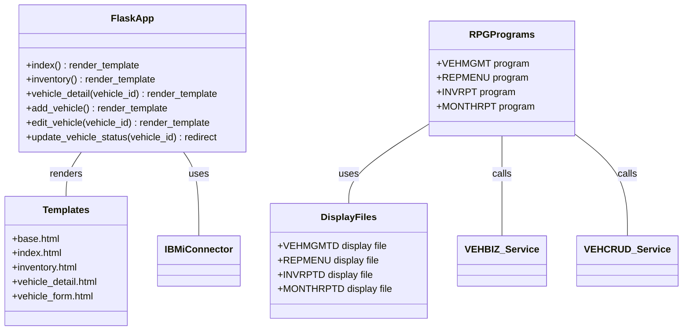

#### Zoom-in: Web Interface Implementation

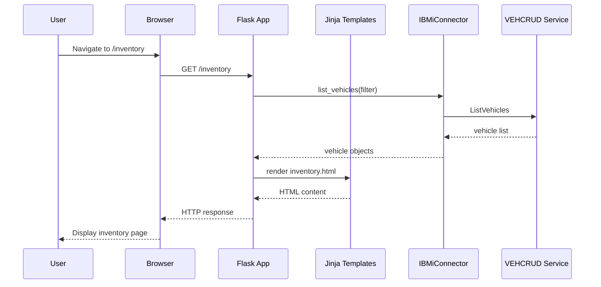

#### Zoom-in: IBM i Interface Implementation

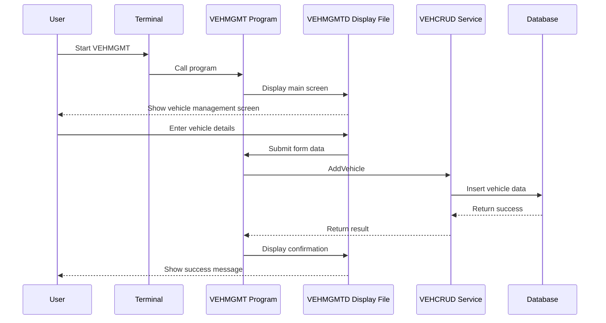

## 4. Integration Architecture

The system integrates IBM i backend services with a Python web interface.

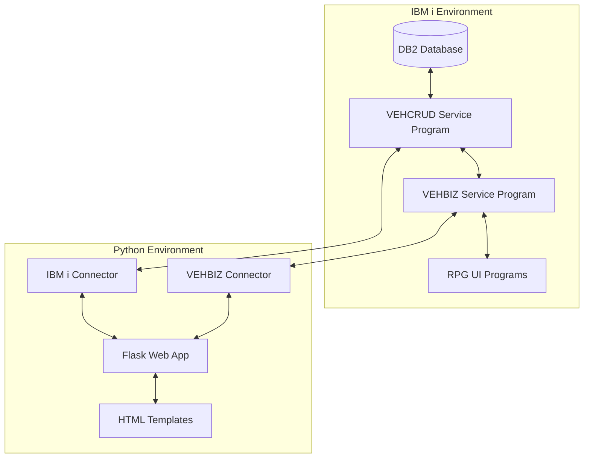

### 4.1 IBM i to Python Integration

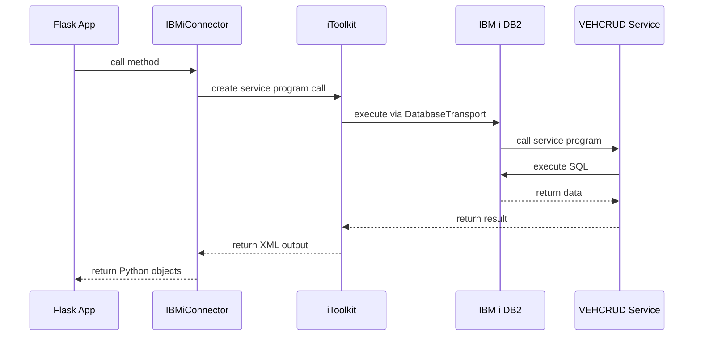

## 5. Deployment Architecture

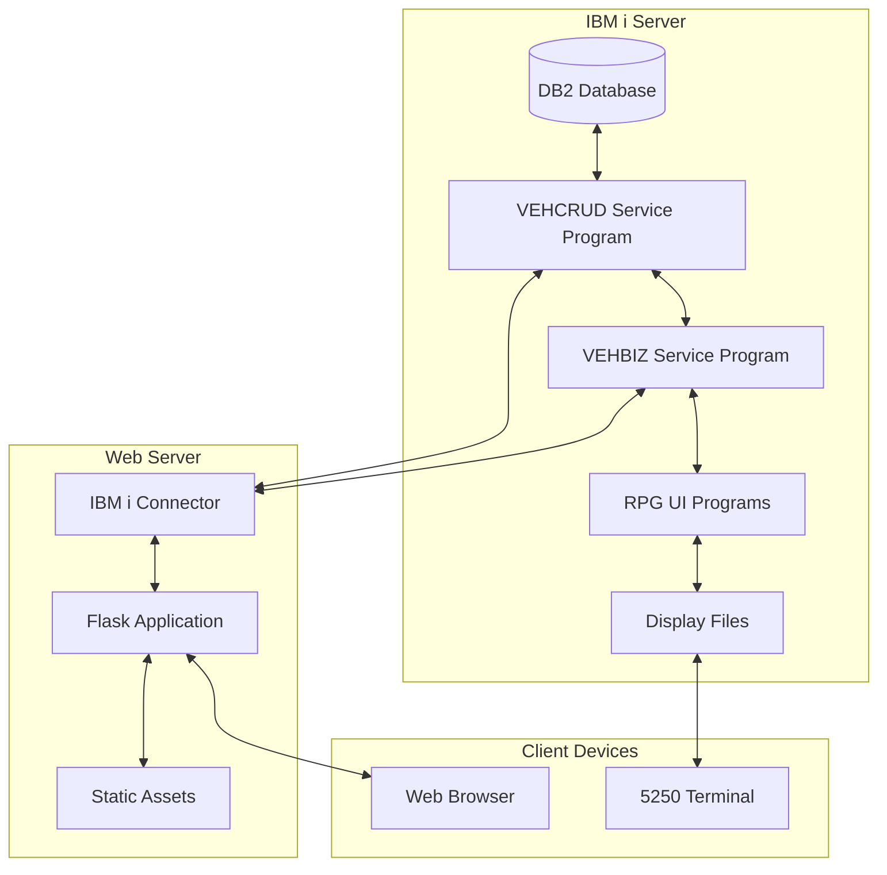

## 6. Security Architecture

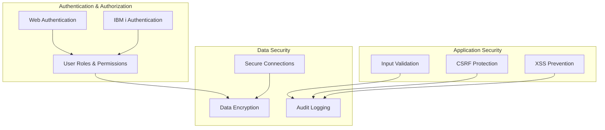

## 7. Conclusion

The Used Car Lot application architecture combines traditional IBM i components with modern web technologies to create a robust, scalable system. The layered architecture ensures separation of concerns, while the integration between IBM i and Python provides flexibility in user interface options.

Key architectural strengths:
- Clear separation of data access, business logic, and presentation layers
- Dual interface options (web and green-screen) using the same backend
- Comprehensive data model with history tracking
- Robust business logic for financial calculations and inventory management
- Secure integration between IBM i and web components