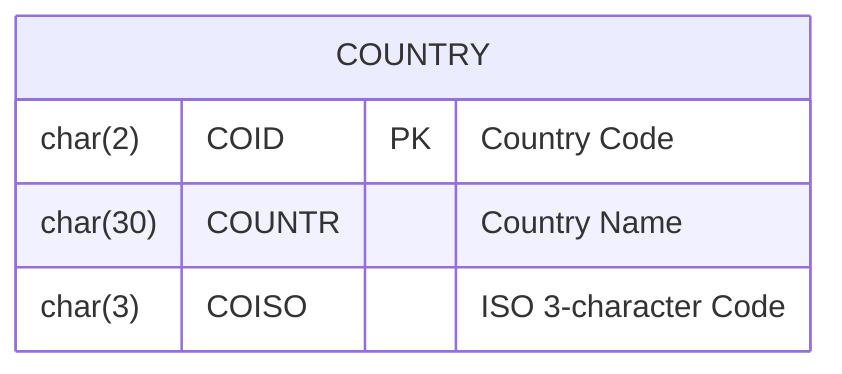
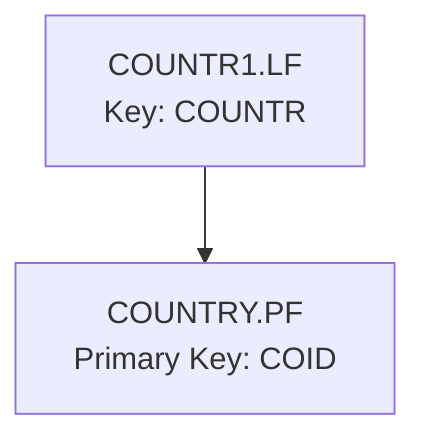
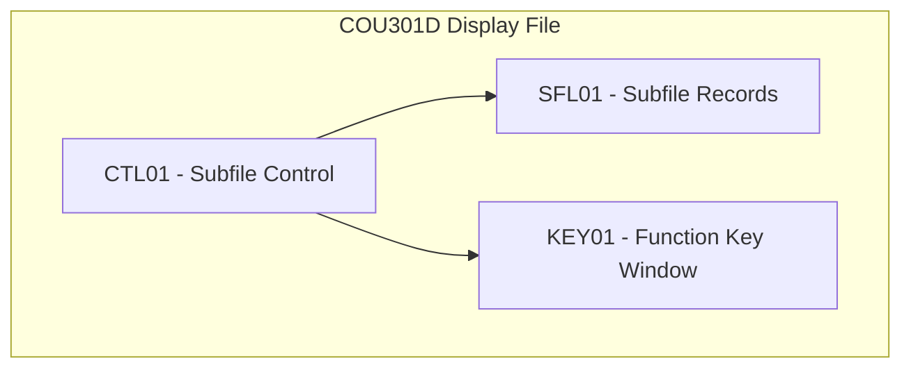
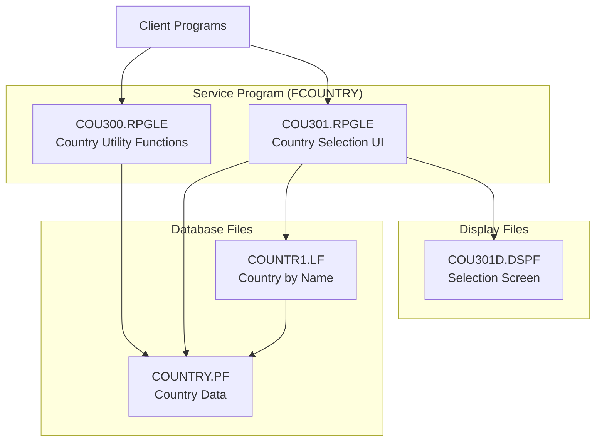
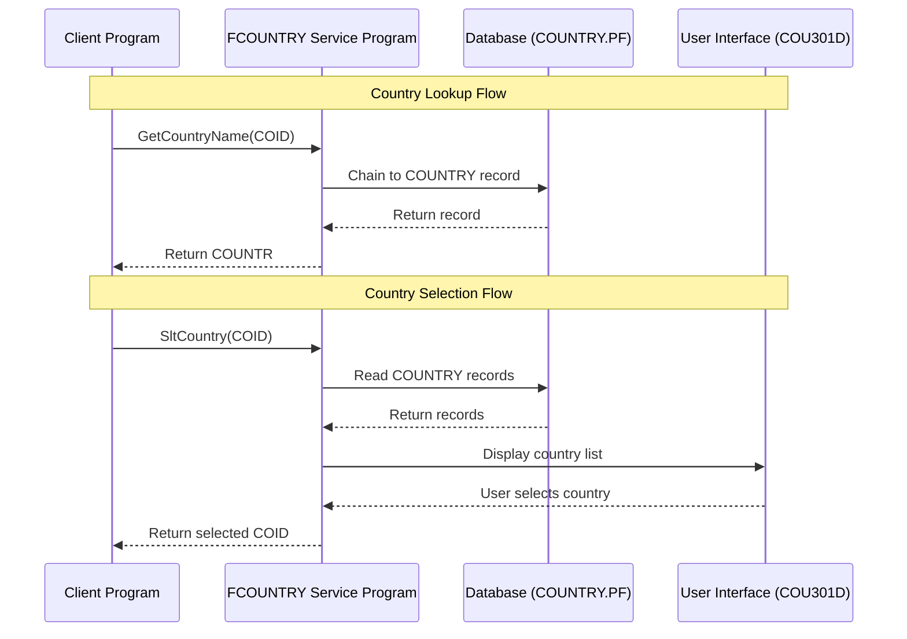
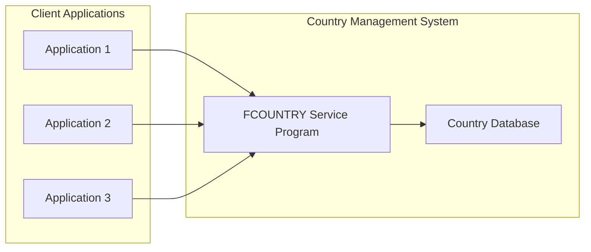

# Country Management System Architecture

This document provides a comprehensive overview of the Country Management System architecture, including database design, user interface, and system components.

## System Overview

The Country Management System is an IBM i (AS/400) application designed to manage country data. It provides functionality to:

1. Store country information (codes, names, ISO codes)
2. Retrieve country information by code
3. Select countries from a list interface
4. Validate country codes

The system follows a modular architecture with separate components for data access, business logic, and user interface.

## Database Design

### Physical Files (Tables)

#### COUNTRY.PF (Country Physical File)

The main database table storing country information:

| Field | Type | Description |
|-------|------|-------------|
| COID  | CHAR(2) | Country Code (Primary Key) |
| COUNTR | CHAR(30) | Country Name |
| COISO | CHAR(3) | ISO 3-character Country Code |

#### SAMREF.PF (Reference File)

A reference file containing field definitions for various entities in the system. For the country management, it defines:

- COID: 2-character country code
- COUNTR: 30-character country name

This file also contains definitions for many other fields used in the broader system (customers, articles, addresses, etc.).

### Logical Files (Indexes)

#### COUNTR1.LF (Country Logical File)

A logical file providing an alternate access path to the COUNTRY physical file:
- Keyed by COUNTR (country name) instead of COID
- Allows for searching and sorting by country name

## User Interface Design

### Display Files

#### COU301D.DSPF (Country Selection Display File)

A display file that provides a user interface for selecting a country from a list:

- Uses a subfile (SFL01) to display multiple country records
- Shows country code and country name for each record
- Provides function keys:
  - F3: Exit
  - F8: Toggle between searching by code and by description
  - F12: Cancel
- Allows options:
  - 1: Select a country
- Supports positioning to a specific country by code or description

## Application Architecture

The application follows a modular design with separate components for different functions:

### Modules

#### COU300.RPGLE (Country Utility Functions)

This module provides utility functions for working with country data:

1. **GetCountryName**: Returns the country name for a given country code
2. **GetCountryIso3**: Returns the ISO 3-character code for a given country code
3. **ExistCountry**: Checks if a country code exists

Internal procedures:
- **chainCOUNTRY**: Opens the country file if needed and retrieves a specific country record
- **closeCOUNTRY**: Closes the country file if it's open

#### COU301.RPGLE (Country Selection UI)

This module provides a function for selecting a country from a list:

1. **sltcountry**: Displays a selection screen and returns the selected country code

The module implements a state machine pattern with the following states:
- **prp**: Prepare (clear subfile)
- **lod**: Load (load records into subfile)
- **dsp**: Display (show subfile)
- **key**: Process function keys
- **chk**: Check user input
- **act**: Act on user selection

### Service Program

#### FCOUNTRY.ILESRVPGM

A service program that combines the COU300 and COU301 modules and exports their functions for use by other programs.

### Include File

#### country.rpgleinc

A copy member (include file) with procedure prototypes that defines the interfaces for the exported procedures:
- GetCountryName
- GetCountryIso3
- ExistCountry
- SltCountry
- CloseCOUNTRY

## Data Flow

## System Integration

The Country Management System is designed to be used by other applications through the service program interface. Client programs can:

1. Include the country.rpgleinc file to get procedure prototypes
2. Call the exported procedures to work with country data
3. Use the country selection screen to allow users to select countries

## Conclusion

The Country Management System is a well-structured application that follows good modular design principles. It separates data access, business logic, and user interface concerns, making it maintainable and reusable. The service program approach allows other applications to easily integrate with the country management functionality.

The system demonstrates several IBM i development best practices:
1. Use of physical and logical files for data storage and access
2. Modular design with separate RPG modules
3. Service program for code reuse
4. Procedure prototypes for interface definition
5. Subfile programming for list displays