# Country Management Application - Architecture Overview

## Introduction

The Country Management application is a subsystem of the larger SAMCO (Sample Company) application. It provides functionality for storing, retrieving, and selecting country information within the system. This document outlines the architecture of the application, including its components, their relationships, and recommendations for modernization.

## Application Functionality Overview

### Purpose and Context

The Country Management subsystem serves as a foundational component within the SAMCO application ecosystem. It provides centralized management of country data that is referenced by other subsystems such as customer management, order processing, and address validation. By maintaining a single source of truth for country information, it ensures data consistency across the entire application.

### Core Functionality

1. **Country Data Storage and Retrieval**
   - Maintains a database of countries with their codes, names, and ISO codes
   - Provides fast lookup of country information by code or name
   - Ensures data integrity through validation and reference mechanisms

2. **Country Selection Interface**
   - Provides an interactive user interface for searching and selecting countries
   - Supports searching by country code or country name
   - Implements pagination for handling large country lists
   - Returns selected country code to calling programs

3. **Country Validation Services**
   - Validates country codes against the database
   - Provides lookup services for country names and ISO codes
   - Ensures data consistency across the application

### Integration with Other Subsystems

The Country Management subsystem integrates with other SAMCO subsystems through:

1. **Service Program Calls**
   - Other programs call exported procedures like `GetCountryName`, `GetCountryIso3`, and `ExistCountry`
   - The `SltCountry` procedure provides an interactive selection interface

2. **Database References**
   - Other subsystems reference the COUNTRY physical file for country data
   - Foreign key relationships may exist between country codes and other entities

3. **Field References**
   - The SAMREF reference file provides consistent field definitions across the system

### User Interaction Flows

1. **Direct Country Code Entry**
   - User enters a country code in another subsystem
   - System validates the code using `ExistCountry`
   - System retrieves country name using `GetCountryName` for display

2. **Country Selection**
   - User needs to select a country in another subsystem
   - System calls `SltCountry` to display selection interface
   - User searches and selects a country
   - Selected country code is returned to the calling program

## System Architecture

The Country Management application follows a traditional IBM i architecture with clear separation between database, business logic, and presentation layers. The following diagram illustrates the complete system architecture with all components and their relationships:

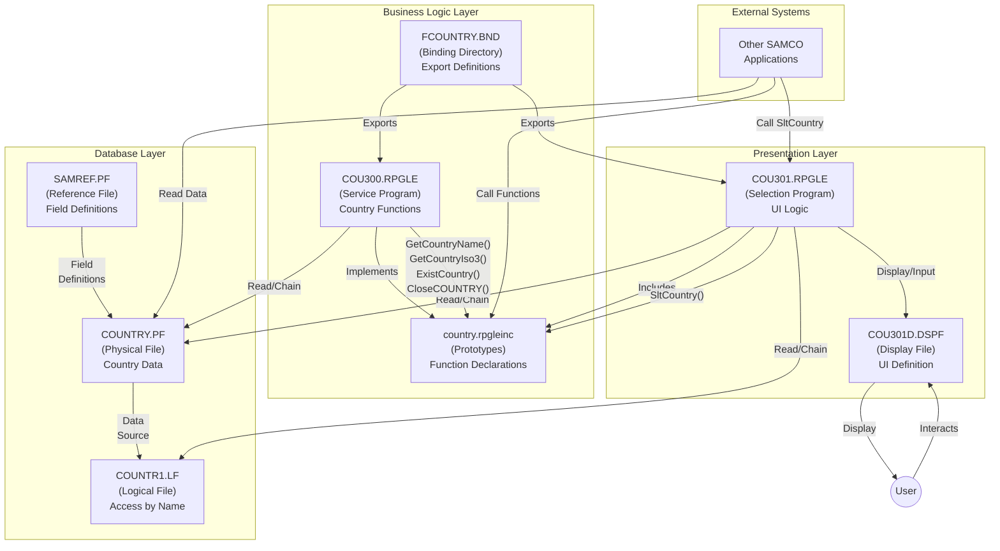

### Component Descriptions

1. **Database Components**
   - **COUNTRY.PF**: Physical file storing country data (code, name, ISO code)
   - **COUNTR1.LF**: Logical file providing access to countries by name
   - **SAMREF.PF**: Reference file defining field attributes for the system

2. **Business Logic Components**
   - **COU300.RPGLE**: Service program implementing country-related functions
   - **country.rpgleinc**: Include file with function prototypes
   - **FCOUNTRY.BND**: Binding directory exporting service program functions

3. **Presentation Components**
   - **COU301.RPGLE**: Program implementing the country selection interface
   - **COU301D.DSPF**: Display file defining the UI for country selection

4. **External Integration**
   - Other SAMCO applications call the exported functions
   - Users interact with the selection interface

## Object Dependencies and Data Flows

The following diagram illustrates the detailed object dependencies and data flows within the Country Management application:

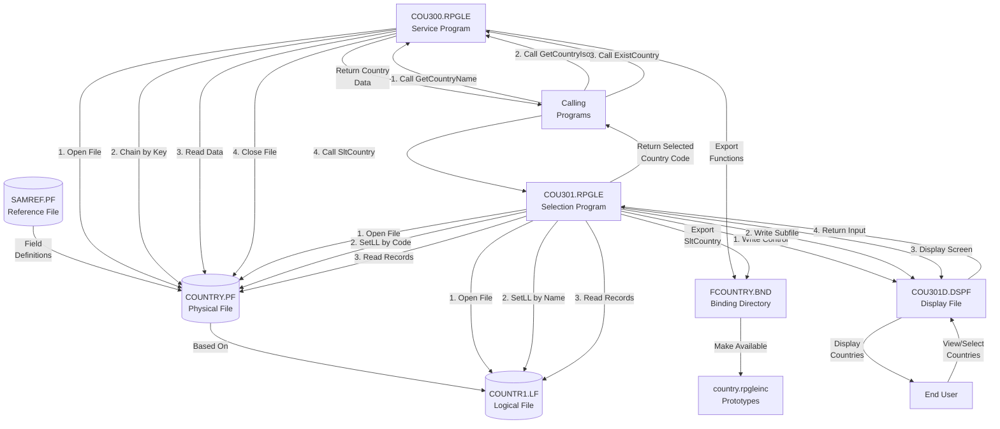

### Key Data Flows

1. **Country Data Access**
   - COU300 opens COUNTRY file, chains by key, reads data, and closes file
   - COU301 reads COUNTRY or COUNTR1 based on search mode (by code or name)

2. **User Interface Interaction**
   - COU301 writes control format and subfile records to COU301D
   - COU301D displays the screen and returns user input to COU301
   - COU301 processes user input and updates the display accordingly

3. **External Program Calls**
   - External programs call GetCountryName, GetCountryIso3, ExistCountry, or SltCountry
   - Functions return country data or selected country code to calling programs

4. **Function Exports**
   - COU300 and COU301 export functions through FCOUNTRY binding directory
   - country.rpgleinc provides function prototypes for external programs

## Database Schema

The database schema consists of a physical file for country data, a logical file for accessing countries by name, and a reference file for field definitions. The following diagram illustrates the detailed database schema:

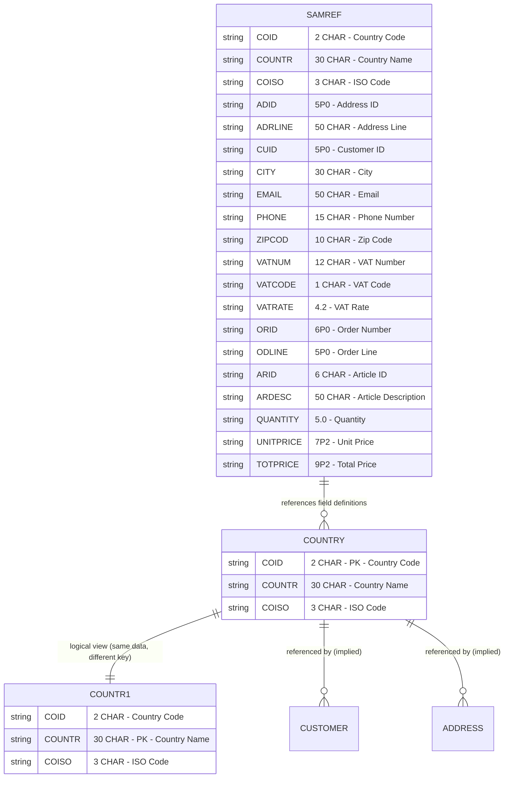

### Physical File Structure (COUNTRY.PF)

```
R FCOUN
  COID      2A       TEXT('COUNTRY CODE')       COLHDG('CO' 'ID')
  COUNTR    30A      TEXT('COUNTRY NAME')       COLHDG('COUNTRY' 'NAME')
  COISO     3A       TEXT('ISO CODE')           COLHDG('ISO' 'CODE')
K COID
```

### Logical File Structure (COUNTR1.LF)

```
R FCOUN                     PFILE(COUNTRY)
K COUNTR
```

### Key Database Design Features

1. **Reference File Pattern**
   - SAMREF.PF defines field attributes that are referenced by COUNTRY.PF
   - Ensures consistent field definitions across the application

2. **Logical View**
   - COUNTR1.LF provides an alternate access path to the same data
   - Allows efficient searching by country name

3. **Unique Key Constraints**
   - COUNTRY.PF is keyed by COID (country code)
   - COUNTR1.LF is keyed by COUNTR (country name)

4. **Implied Relationships**
   - Other files in the SAMCO application likely reference COUNTRY.PF
   - Foreign key relationships may exist but are not explicitly defined

## User Interface Flow

The user interface for the country selection program (COU301) follows a subfile-based design pattern common in IBM i applications. The following diagram illustrates the detailed user interface flow:

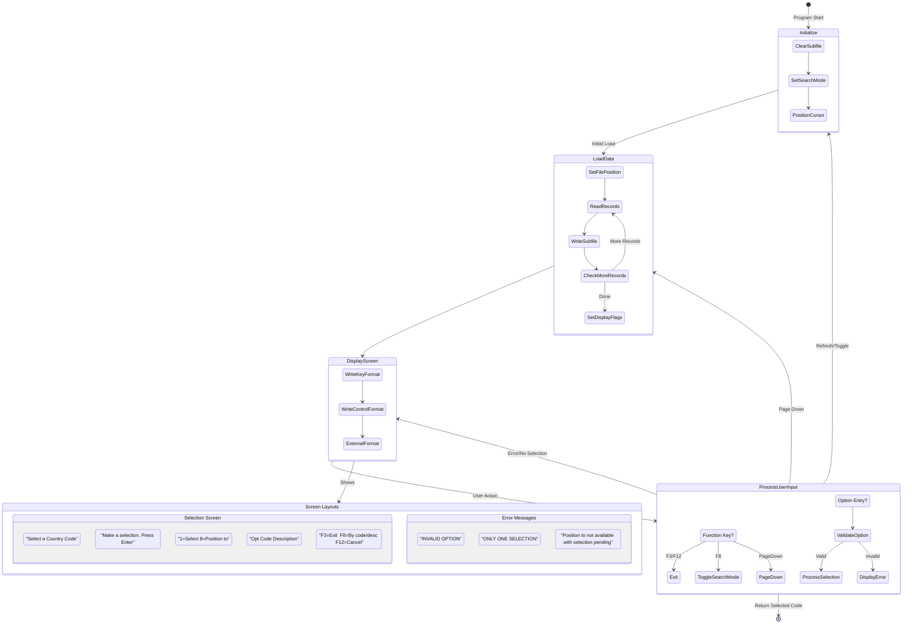

### Screen Layout and Components

1. **Main Selection Screen**
   - Title: "Select a Country Code"
   - Instructions: "Make a selection. Press Enter"
   - Column Headers: "Opt Code Description"
   - Function Keys: F3=Exit, F8=By code/desc, F12=Cancel
   - Subfile with country list (10 visible records, scrollable)
   - Position To field for quick navigation

2. **User Interaction Elements**
   - Option Column: Enter "1" to select a country
   - Position To: Enter code or description to position the list
   - Function Keys: Navigate and control the interface
   - Page Down: View more records

3. **Error Messages**
   - "INVALID OPTION": When an invalid option is entered
   - "ONLY ONE SELECTION": When multiple selections are attempted
   - "Position to not available with selection pending": When trying to position with selections made

### Detailed Interaction Flows

1. **Initial Display**
   ```
   COU301                 Select a Country Code
   
   Make a selection. Press Enter
   1=Select  8=Position to
   Opt Code Description
   _   US  UNITED STATES
   _   CA  CANADA
   _   MX  MEXICO
   _   UK  UNITED KINGDOM
   _   FR  FRANCE
   _   DE  GERMANY
   _   IT  ITALY
   _   ES  SPAIN
   _   JP  JAPAN
   _   CN  CHINA
   
   F3=Exit  F8=By desc.  F12=Cancel
   ```

2. **Search by Description**
   ```
   COU301                 Select a Country Code
   
   Make a selection. Press Enter
   1=Select  8=Position to
   Opt Code Description
   _   AR  ARGENTINA
   _   AU  AUSTRALIA
   _   AT  AUSTRIA
   _   BE  BELGIUM
   _   BR  BRAZIL
   _   CA  CANADA
   _   CL  CHILE
   _   CN  CHINA
   _   CO  COLOMBIA
   _   CR  COSTA RICA
   
   F3=Exit  F8=By code  F12=Cancel
   ```

3. **Position To Example**
   ```
   COU301                 Select a Country Code
   
   Make a selection. Press Enter
   1=Select  8=Position to
   Opt Code Description
   8   __  ________________________
   _   UK  UNITED KINGDOM
   _   US  UNITED STATES
   _   UY  URUGUAY
   _   VE  VENEZUELA
   _   VN  VIETNAM
   _   ZA  SOUTH AFRICA
   _   ZM  ZAMBIA
   _   ZW  ZIMBABWE
   
   F3=Exit  F8=By desc.  F12=Cancel
   ```

## Architecture Patterns and Design Principles

The Country Management application demonstrates several architectural patterns and design principles common in traditional IBM i applications. This section provides a thorough analysis of these patterns and principles.

### 1. Layered Architecture

The application follows a three-tier architectural pattern:

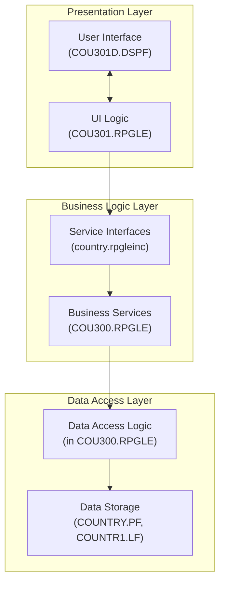

**Key Principles:**
- **Separation of Concerns**: Each layer has distinct responsibilities
- **Information Hiding**: Implementation details are hidden from higher layers
- **Interface-Based Design**: Layers interact through well-defined interfaces

### 2. Service-Oriented Design

The application implements a service-oriented design through its exported procedures:

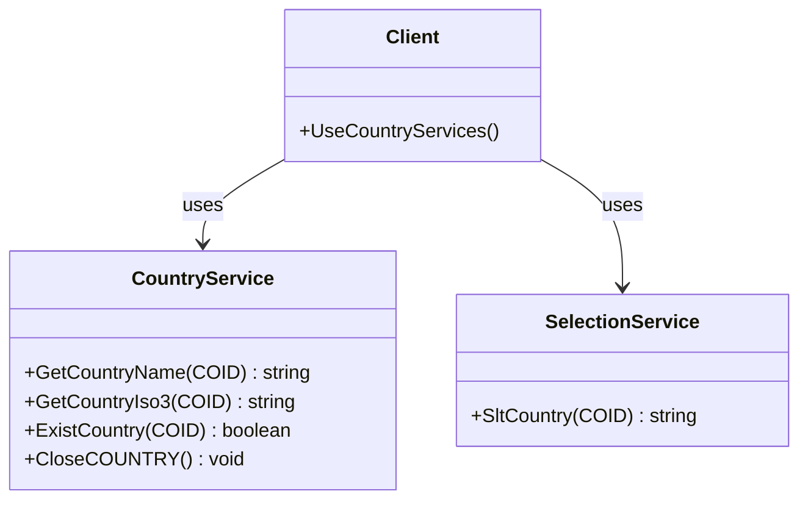

**Key Principles:**
- **Service Encapsulation**: Services hide implementation details
- **Service Reusability**: Services can be used by multiple clients
- **Service Contract**: Services have well-defined interfaces
- **Service Autonomy**: Services control their own resources

### 3. Model-View-Controller Pattern

The application implements an MVC-like pattern:

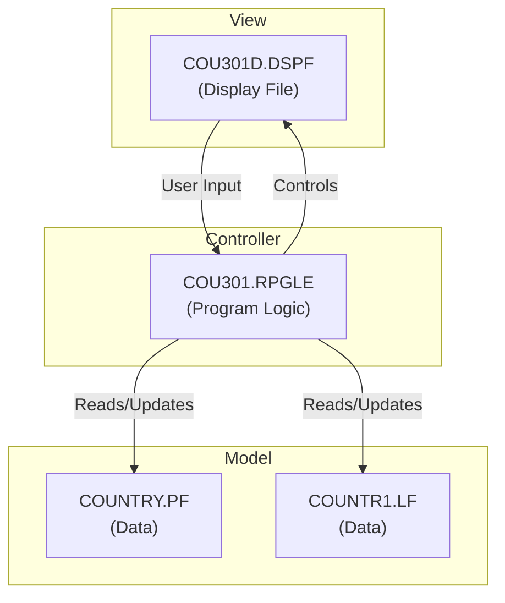

**Key Principles:**
- **Separation of Presentation and Logic**: UI is separate from business logic
- **Data Independence**: Model is independent of how it's displayed
- **Controller Mediation**: Controller coordinates interactions

### 4. State Machine Pattern

The COU301 program implements a state machine pattern to control program flow:

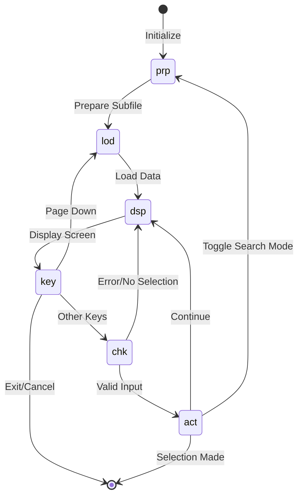

**Key Principles:**
- **State-Based Behavior**: Program behavior depends on current state
- **Explicit State Transitions**: Clear transitions between states
- **State Encapsulation**: Each state has its own subroutine

### 5. Data Access Patterns

The application implements several data access patterns:

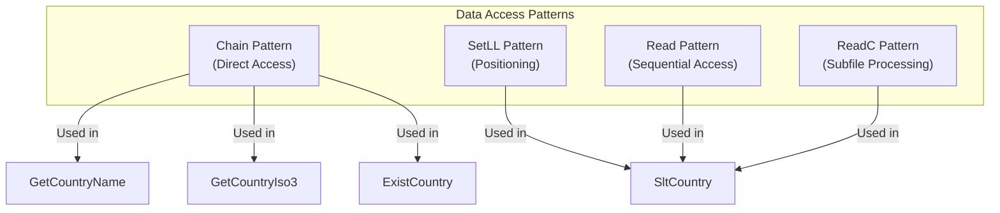

**Key Principles:**
- **Data Encapsulation**: Data access is encapsulated in specific procedures
- **Optimized Access**: Different access methods for different needs
- **Resource Management**: Files are opened and closed appropriately

### 6. UI Design Patterns

The application implements several UI design patterns:

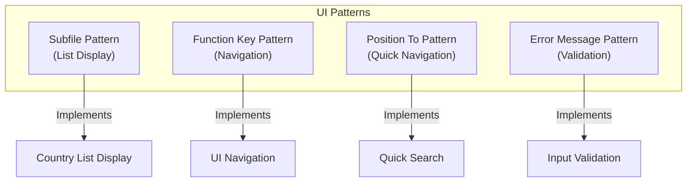

**Key Principles:**
- **Consistent UI Patterns**: Familiar patterns for IBM i users
- **Efficient Navigation**: Function keys and position-to for quick access
- **Clear Feedback**: Error messages for invalid input
- **Optimized Display**: Subfile for efficient list handling

### 7. Integration Patterns

The application implements several integration patterns:

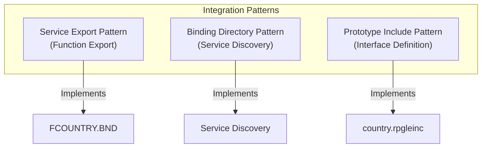

**Key Principles:**
- **Service Discovery**: Binding directory for locating services
- **Interface Definition**: Prototypes for defining service interfaces
- **Loose Coupling**: Programs interact through well-defined interfaces

## Modernization Recommendations

Based on the detailed analysis of the Country Management application, here are comprehensive recommendations for modernization:

### 1. Technology Stack Modernization

1. **Convert to Free-Format RPG**
   - Move from fixed-format to fully free-format RPG for better readability and maintainability
   - Leverage modern RPG features like data structures, procedures, and built-in functions
   - Example transformation:

   **Before:**
   ```rpgle
   FCOUNTRY   IF   E           K DISK
   C     KF            KLIST
   C                   KFLD                    K_COID
   C                   CHAIN     KF            COUNTRY
   ```

   **After:**
   ```rpgle
   dcl-f COUNTRY keyed usage(*input) usropn;
   
   dcl-ds countryKey qualified;
     coid like(COID);
   end-ds;
   
   countryKey.coid = inputCoid;
   chain countryKey COUNTRY;
   ```

2. **Database Modernization**
   - Convert DDS-defined physical and logical files to SQL tables and views
   - Use SQL for data access instead of native I/O operations
   - Implement proper constraints and relationships in the database

   **SQL Table Definition:**
   ```sql
   CREATE TABLE COUNTRY (
     COID CHAR(2) NOT NULL PRIMARY KEY,
     COUNTR VARCHAR(30) NOT NULL,
     COISO CHAR(3) NOT NULL,
     CONSTRAINT COUNTRY_UK1 UNIQUE (COUNTR)
   );
   
   CREATE INDEX COUNTRY_IX1 ON COUNTRY (COUNTR);
   ```

3. **Adopt SQL Stored Procedures**
   - Move some business logic to SQL stored procedures where appropriate
   - Use SQL for complex data operations instead of RPG logic

   **Example Stored Procedure:**
   ```sql
   CREATE PROCEDURE GetCountryName (
     IN p_COID CHAR(2),
     OUT p_COUNTR VARCHAR(30)
   )
   LANGUAGE SQL
   BEGIN
     SELECT COUNTR INTO p_COUNTR
     FROM COUNTRY
     WHERE COID = p_COID;
   END;
   ```

### 2. Architecture Improvements

1. **Implement a Proper Layered Architecture**

   ```mermaid
   graph TD
     subgraph "Presentation Layer"
       WebUI["Web UI<br>(HTML/JS/CSS)"]
       MobileUI["Mobile UI<br>(Responsive)"]
       LegacyUI["Legacy UI<br>(5250)"]
     end
     
     subgraph "API Layer"
       REST["REST API<br>(JSON/HTTP)"]
       SOAP["SOAP API<br>(XML/HTTP)"]
       RPG["RPG API<br>(Service Program)"]
     end
     
     subgraph "Business Logic Layer"
       Services["Business Services"]
       Validation["Validation Logic"]
       Workflow["Workflow Logic"]
     end
     
     subgraph "Data Access Layer"
       DAO["Data Access Objects"]
       ORM["Object-Relational Mapping"]
       SQL["SQL Operations"]
     end
     
     subgraph "Data Layer"
       DB["Database<br>(SQL Tables/Views)"]
     end
     
     WebUI --> REST
     MobileUI --> REST
     LegacyUI --> RPG
     
     REST --> Services
     SOAP --> Services
     RPG --> Services
     
     Services --> Validation
     Services --> Workflow
     
     Validation --> DAO
     Workflow --> DAO
     
     DAO --> ORM
     DAO --> SQL
     
     ORM --> DB
     SQL --> DB
   ```

2. **API-First Approach**
   - Create RESTful or SOAP web services to expose country management functionality
   - Use IBM i's integrated web services support or third-party tools

   **Example REST API Endpoints:**
   ```
   GET /api/countries - List all countries
   GET /api/countries/{code} - Get country by code
   GET /api/countries/search?name={name} - Search countries by name
   POST /api/countries - Create a new country
   PUT /api/countries/{code} - Update a country
   DELETE /api/countries/{code} - Delete a country
   ```

3. **Dependency Injection**
   - Implement dependency injection for better testability and flexibility
   - Use service locators or dependency injection frameworks

   **Example with Dependency Injection:**
   ```rpgle
   // Interface
   dcl-pr ICountryRepository;
     getByCode: pointer;
     getByName: pointer;
     // other methods
   end-pr;
   
   // Service using repository
   dcl-proc CountryService;
     dcl-pi *n;
       repository pointer value;  // Injected dependency
     end-pi;
     
     dcl-s repo like(ICountryRepository) based(repository);
     
     // Use the repository through its interface
   end-proc;
   ```

### 3. User Interface Modernization

1. **Web-Based Interface**

   ```mermaid
   graph TD
     subgraph "Frontend"
       HTML["HTML5"]
       CSS["CSS3"]
       JS["JavaScript"]
       FW["Framework<br>(React/Angular/Vue)"]
     end
     
     subgraph "Backend"
       API["REST API"]
       Auth["Authentication"]
       BL["Business Logic"]
     end
     
     subgraph "Database"
       SQL["SQL Database"]
     end
     
     HTML --> FW
     CSS --> FW
     JS --> FW
     
     FW --> API
     API --> Auth
     API --> BL
     BL --> SQL
   ```

2. **Responsive Design**
   - Ensure the new interface works on various devices (desktop, tablet, mobile)
   - Implement modern UI/UX principles for better user experience

   **Example Responsive UI:**
   ```html
   <!DOCTYPE html>
   <html>
   <head>
     <meta name="viewport" content="width=device-width, initial-scale=1.0">
     <title>Country Selection</title>
     <link rel="stylesheet" href="styles.css">
   </head>
   <body>
     <div class="container">
       <h1>Select a Country</h1>
       <div class="search-container">
         <input type="text" id="search" placeholder="Search by name or code">
         <button id="search-toggle">Toggle Search Mode</button>
       </div>
       <div class="countries-list">
         <!-- Country list will be populated here -->
       </div>
       <div class="pagination">
         <button id="prev-page">Previous</button>
         <button id="next-page">Next</button>
       </div>
     </div>
     <script src="app.js"></script>
   </body>
   </html>
   ```

3. **Progressive Enhancement**
  - Consider a hybrid approach where green-screen and web interfaces coexist
  - Allow gradual migration of users to the new interface
  - Implement feature detection to provide enhanced functionality when available

### 4. Integration Capabilities

1. **API Gateway**
  - Implement an API gateway to expose country management functionality
  - Support multiple protocols (REST, SOAP, GraphQL)
  - Provide authentication, rate limiting, and monitoring

  ```mermaid
  graph LR
    Client["Client Applications"] --> Gateway["API Gateway"]
    Gateway --> Auth["Authentication"]
    Gateway --> Rate["Rate Limiting"]
    Gateway --> Log["Logging/Monitoring"]
    Gateway --> CountryAPI["Country API"]
    CountryAPI --> CountryService["Country Service"]
    CountryService --> Database["Database"]
  ```

2. **Event-Driven Architecture**
  - Implement event publishing for country data changes
  - Allow other systems to subscribe to these events
  - Use message queues or pub/sub mechanisms

  ```mermaid
  graph TD
    CountryService["Country Service"] -->|"Publishes"| EventBus["Event Bus"]
    EventBus -->|"Country.Created"| Subscriber1["Audit Service"]
    EventBus -->|"Country.Updated"| Subscriber2["Cache Service"]
    EventBus -->|"Country.Deleted"| Subscriber3["Notification Service"]
    EventBus -->|"All Events"| Subscriber4["Analytics Service"]
  ```

3. **Microservices Approach**
  - Consider breaking down the monolithic application into microservices
  - Make Country Management a standalone service with its own API
  - Implement service discovery and orchestration

### 5. Development Process Improvements

1. **Source Control**
  - Move all source code to a modern version control system like Git
  - Implement branching strategies and code review processes
  - Set up continuous integration pipelines

2. **Automated Testing**
  - Implement unit tests for business logic
  - Create integration tests for APIs
  - Set up automated UI testing for web interfaces
  - Implement test-driven development practices

  ```mermaid
  graph TD
    subgraph "Testing Strategy"
      Unit["Unit Tests<br>(Business Logic)"]
      Integration["Integration Tests<br>(APIs)"]
      UI["UI Tests<br>(Web Interface)"]
      Performance["Performance Tests"]
    end
    
    Unit --> Integration
    Integration --> UI
    UI --> Performance
  ```

3. **CI/CD Pipeline**
  - Implement continuous integration and deployment
  - Automate build, test, and deployment processes
  - Set up environment promotion (dev, test, prod)

  ```mermaid
  graph LR
    Code["Source Code"] --> Build["Build"]
    Build --> UnitTest["Unit Tests"]
    UnitTest --> IntegrationTest["Integration Tests"]
    IntegrationTest --> Package["Package"]
    Package --> Deploy["Deploy to Dev"]
    Deploy --> UITest["UI Tests"]
    UITest --> Promote["Promote to Test"]
    Promote --> PerfTest["Performance Tests"]
    PerfTest --> Production["Deploy to Production"]
  ```

4. **Documentation**
  - Generate API documentation automatically
  - Maintain architecture and design documentation
  - Create user guides and developer documentation

### 6. Phased Implementation Approach

1. **Phase 1: Code Modernization**
  - Convert to free-format RPG
  - Refactor to improve code quality
  - Implement proper error handling

2. **Phase 2: Database Modernization**
  - Convert to SQL tables and views
  - Implement proper constraints
  - Update data access code

3. **Phase 3: API Development**
  - Create RESTful APIs for country management
  - Implement proper authentication and authorization
  - Develop API documentation

4. **Phase 4: UI Modernization**
  - Develop web-based interface
  - Implement responsive design
  - Integrate with APIs

5. **Phase 5: Integration and Extension**
  - Implement event-driven architecture
  - Integrate with other systems
  - Extend functionality as needed

## Conclusion

The Country Management application is a well-structured but traditional IBM i application. While it follows good architectural patterns for its time, there are significant opportunities for modernization to improve maintainability, scalability, and integration capabilities.

By implementing the recommended modernization strategies, the application can be transformed into a modern, web-enabled service while preserving its core functionality. The phased approach allows for incremental improvements without disrupting existing operations, ensuring a smooth transition to the modernized architecture.

The enhanced architecture will provide:

1. **Better User Experience**: Modern web interfaces accessible from any device
2. **Improved Maintainability**: Clean, modular code with clear separation of concerns
3. **Enhanced Integration**: APIs and event-driven architecture for seamless integration
4. **Greater Scalability**: Microservices approach for independent scaling and deployment
5. **Robust Development Process**: Modern tools and practices for efficient development

These improvements will position the Country Management subsystem as a valuable component in the modernized SAMCO application ecosystem, ready to meet current and future business needs.