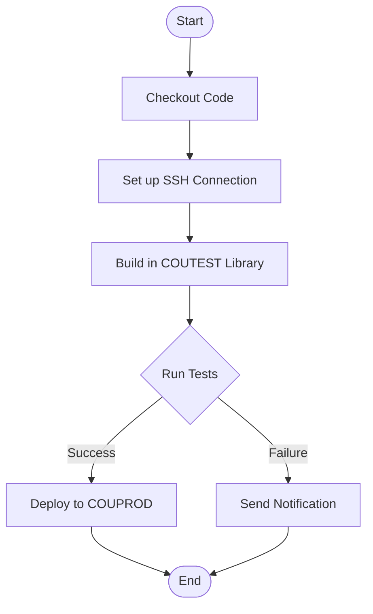

# CI/CD Pipeline for Country Management Application

This document describes the Continuous Integration and Continuous Deployment (CI/CD) pipeline for the Country Management application using GitHub Actions.

## Pipeline Overview

The pipeline performs the following steps:
1. Pull the code from Git repository
2. Build the code into the COUTEST library
3. Run tests against the COUTEST library
4. If tests succeed, deploy to the COUPROD library

## GitHub Actions Workflow

Create a file at `.github/workflows/ibmi-ci-cd.yml` with the following content:

```yaml
name: IBM i CI/CD Pipeline

on:
  push:
    branches: [ main ]
  pull_request:
    branches: [ main ]
  workflow_dispatch:
    # Allow manual triggering

jobs:
  build-and-test:
    name: Build and Test
    runs-on: ubuntu-latest
    
    steps:
    - name: Checkout code
      uses: actions/checkout@v3
      
    - name: Setup Node.js
      uses: actions/setup-node@v3
      with:
        node-version: '18'
        
    - name: Install IBM i CI tools
      run: |
        npm install -g @ibm/ibmi-ci
        
    - name: Create build directory
      run: mkdir -p builds/country-management
        
    - name: Build in COUTEST library
      env:
        IBMI_HOST: ${{ secrets.IBMI_HOST }}
        IBMI_USER: ${{ secrets.IBMI_USER }}
        IBMI_PASSWORD: ${{ secrets.IBMI_PASSWORD }}
      run: |
        echo "Building application in COUTEST library..."
        
        # Create COUTEST library if it doesn't exist
        ici --host $IBMI_HOST --user $IBMI_USER --password $IBMI_PASSWORD \
            --cmd "CRTLIB LIB(COUTEST) TEXT('Country Management Test Library')" || true
        
        # Clear previous objects if needed
        ici --host $IBMI_HOST --user $IBMI_USER --password $IBMI_PASSWORD \
            --cmd "CLRLIB LIB(COUTEST)"
        
        # Push source code to IBM i
        ici --host $IBMI_HOST --user $IBMI_USER --password $IBMI_PASSWORD \
            --rcwd "./builds/country-management" \
            --push "."
        
        # Build the application using makei
        ici --host $IBMI_HOST --user $IBMI_USER --password $IBMI_PASSWORD \
            --rcwd "./builds/country-management" \
            --cmd "CURLIB=COUTEST /QOpenSys/pkgs/bin/makei build"
        
    - name: Run tests
      id: tests
      env:
        IBMI_HOST: ${{ secrets.IBMI_HOST }}
        IBMI_USER: ${{ secrets.IBMI_USER }}
        IBMI_PASSWORD: ${{ secrets.IBMI_PASSWORD }}
      run: |
        echo "Running tests against COUTEST library..."
        
        # Run tests using makei test or custom test command
        ici --host $IBMI_HOST --user $IBMI_USER --password $IBMI_PASSWORD \
            --rcwd "./builds/country-management" \
            --cmd "CURLIB=COUTEST /QOpenSys/pkgs/bin/makei test" || exit 1
        
        echo "Tests completed successfully"
      
    - name: Deploy to production
      if: steps.tests.outcome == 'success'
      env:
        IBMI_HOST: ${{ secrets.IBMI_HOST }}
        IBMI_USER: ${{ secrets.IBMI_USER }}
        IBMI_PASSWORD: ${{ secrets.IBMI_PASSWORD }}
      run: |
        echo "Deploying to COUPROD library..."
        
        # Create COUPROD library if it doesn't exist
        ici --host $IBMI_HOST --user $IBMI_USER --password $IBMI_PASSWORD \
            --cmd "CRTLIB LIB(COUPROD) TEXT('Country Management Production Library')" || true
        
        # Save old objects if needed for rollback
        ici --host $IBMI_HOST --user $IBMI_USER --password $IBMI_PASSWORD \
            --cmd "SAVLIB LIB(COUPROD) DEV(*SAVF) SAVF(QGPL/COUPROD_BKP)"
        
        # Clear production library
        ici --host $IBMI_HOST --user $IBMI_USER --password $IBMI_PASSWORD \
            --cmd "CLRLIB LIB(COUPROD)"
        
        # Copy objects from test to production
        ici --host $IBMI_HOST --user $IBMI_USER --password $IBMI_PASSWORD \
            --cmd "CPYOBJ OBJ(COUTEST/*ALL) TOLIB(COUPROD) OBJTYPE(*ALL)"
        
        # Verify deployment
        ici --host $IBMI_HOST --user $IBMI_USER --password $IBMI_PASSWORD \
            --cmd "DSPOBJD OBJ(COUPROD/*ALL) OBJTYPE(*ALL)"
        
        echo "Deployment completed successfully"
        
    - name: Notify on failure
      if: failure()
      run: |
        echo "Pipeline failed. Sending notification..."
        # Add notification logic here (email, Slack, etc.)
```

## Required Secrets

To use this workflow, you need to set up the following secrets in your GitHub repository:

1. `IBMI_HOST`: The hostname or IP address of the IBM i system
2. `IBMI_USER`: The username for the IBM i system
3. `IBMI_PASSWORD`: The password for the IBM i system

Note: For production environments, consider using SSH keys or other secure authentication methods supported by the ibmi-ci tool.

## Pipeline Diagram



## IBM i CI Tool

This pipeline uses the `@ibm/ibmi-ci` tool (abbreviated as `ici`), which is a modern command-line utility designed specifically for IBM i continuous integration and deployment workflows. It provides a simpler and more maintainable approach compared to direct SSH commands.

### Installation

```bash
npm install -g @ibm/ibmi-ci
```

### Key Features

- Push source code to IBM i
- Execute commands on IBM i
- Set current library for command execution
- Manage IFS files and directories
- Support for various authentication methods

### Common Usage Patterns

```bash
# Push local files to IBM i
ici --host hostname --user username --password password --rcwd "/remote/directory" --push "local/directory"

# Execute a command on IBM i
ici --host hostname --user username --password password --cmd "COMMAND"

# Execute a command with specific library
ici --host hostname --user username --password password --cmd "CURLIB=MYLIB COMMAND"
```

## Customization

This pipeline can be customized based on your specific requirements:

1. **Build Process**: Modify the build commands to match your specific build process
2. **Testing**: Replace the placeholder test commands with your actual test suite
3. **Deployment**: Adjust the deployment strategy based on your requirements
4. **Notifications**: Configure notifications for success/failure events

## Rollback Strategy

In case of deployment issues, you can implement a rollback strategy:

1. Before deployment, save the current production objects to a save file
2. If deployment fails or causes issues, restore from the save file
3. Add a manual approval step before deploying to production for critical changes

## Security Considerations

1. Use GitHub secrets for all sensitive information
2. Limit the permissions of the IBM i user used for deployment
3. Consider implementing IP restrictions for SSH access
4. Regularly rotate SSH keys and credentials