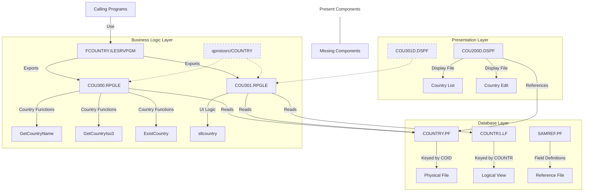

# Technical Overview of Country Management System

This document provides a comprehensive analysis of the IBM i (AS/400) Country Management System codebase.

## 1. Code Components and Relationships

### Database Files
- **COUNTRY.PF**: Physical file (database table) storing country information
  - Record format: FCOUN
  - Fields:
    - COID: Country code (key field, 2 characters)
    - COUNTR: Country name
    - COISO: ISO code (3 characters)
  - Defined as UNIQUE with reference to SAMREF

- **COUNTR1.LF**: Logical file (view) of COUNTRY.PF
  - Uses the same record format (FCOUN)
  - Keyed by COUNTR (country name) for alphabetical access
  - Allows accessing country data sorted by name

- **SAMREF.PF**: Reference file containing field definitions
  - Serves as a central repository for field definitions
  - Contains definitions for various entities including countries, customers, addresses, etc.
  - Provides standardized column headings, edit codes, and text descriptions

### Display Files
- **COU200D.DSPF**: Display file for working with countries
  - Record formats:
    - SFL01: Subfile (list) to display countries
    - CTL01: Control format for the subfile
    - KEY01: Function key definitions
    - FMT02: Format for editing a country record
  - Supports operations like viewing a list of countries and editing country details
  - References fields from the COUNTRY file

- **COU301D.DSPF**: Display file for country selection (referenced but missing)
  - Used by the COU301.RPGLE module for the country selection interface
  - Based on code analysis, likely contains:
    - A subfile for displaying country list
    - Control format for the subfile
    - Function key definitions
    - Support for toggling between code and name order

### RPG Modules
- **COU300.RPGLE**: Module with exported procedures for country data access
  - Procedures:
    - `GetCountryName`: Returns the country name for a given country code
    - `GetCountryIso3`: Returns the ISO code for a given country code
    - `ExistCountry`: Checks if a country code exists
    - `chainCOUNTRY`: Internal procedure to read a country record
    - `closeCOUNTRY`: Closes the country file
  - Uses /copy directive to include COUNTRY prototypes

- **COU301.RPGLE**: Module for country selection interface
  - Exports the `sltcountry` procedure which displays a selection screen
  - Uses both COUNTRY.PF and COUNTR1.LF files
  - Implements a subfile-based selection interface
  - Allows toggling between selection by code or by description (F8)
  - Handles subfile loading, display, and processing

### Service Program
- **FCOUNTRY.ILESRVPGM**: Service program binding specification
  - Combines COU300 and COU301 modules
  - Exports procedures for use by other programs
  - Uses *CALLER activation group

## 2. Database Schema Design

### Tables
- **COUNTRY**: Main table storing country information
  - Primary key: COID (Country Code)

### Relationships
- No explicit foreign key relationships defined in the examined code
- The system appears to be part of a larger application with potential relationships to other tables (customer, address, etc.) as suggested by the SAMREF fields

### Constraints
- UNIQUE constraint on the COUNTRY table
- Implicit constraints through RPG business logic

### Indexing
- Primary index on COID in COUNTRY.PF
- Secondary index on COUNTR in COUNTR1.LF for efficient name-based lookups

## 3. User Interface Architecture

### Screen Flow
1. **Country List Screen** (COU200D - CTL01/SFL01)
   - Displays a list of countries with their codes and ISO codes
   - Allows selecting a country for editing (option 2)
   - Function keys: F3=Exit, F12=Cancel

2. **Country Edit Screen** (COU200D - FMT02)
   - Displays and allows editing of country details
   - Fields: Country Code (display only), Country Name, ISO Code
   - Function keys: F3=Exit, F12=Cancel

3. **Country Selection Screen** (COU301D - referenced but missing)
   - Used by the sltcountry procedure in COU301.RPGLE
   - Likely provides a subfile-based interface for selecting countries
   - Supports toggling between code and name order (F8)
   - Returns the selected country code to the calling program

### Component Hierarchy
- The UI follows the traditional IBM i subfile pattern:
  - Control record format (CTL01) manages the subfile
  - Subfile record format (SFL01) displays multiple records
  - Function key record format (KEY01) shows available function keys
  - Edit record format (FMT02) for detailed editing

### State Management
- State is managed through RPG program variables and indicators
- Subfile processing state is tracked through step variables (prp, lod, dsp, key, chk, act)
- Indicators control display attributes and function key handling

### User Interaction Flows
1. **View Countries**:
   - User opens the application
   - System loads and displays the country list
   - User can page through the list (PageDown)

2. **Edit Country**:
   - User selects a country with option 2
   - System displays the edit screen with country details
   - User modifies fields and presses Enter
   - System validates and saves changes

3. **Country Selection** (via COU301):
   - Application calls the sltcountry procedure
   - User views the country selection screen
   - User can toggle between code and name order (F8)
   - User selects a country with option 1
   - System returns the selected country code

## 4. System Architecture Diagram

## 5. Implementation Patterns and Design Decisions

### Modular Design
- The system uses ILE RPG modules and service programs for code organization
- Separation of data access (COU300) from UI logic (COU301)
- Exported procedures provide a clean API for country-related operations

### Field Reference Files
- Use of SAMREF as a central repository for field definitions
- Promotes consistency in field attributes across the application

### Subfile Processing
- Traditional IBM i subfile pattern for displaying lists of data
- Step-based processing (prepare, load, display, key handling, check, action)

### Data Access
- Direct file access using RPG file specifications
- Caching of the last accessed record to improve performance
- File open/close management to ensure resources are properly handled

### UI Patterns
- Function key standardization (F3=Exit, F12=Cancel)
- Option-based interaction (2=Edit, 1=Select)
- Toggle functionality (F8 to switch between code and name order)

## 6. Key Dependencies and Integrations

### Internal Dependencies
- **Field Definitions**: Relies on SAMREF.PF for standardized field definitions
- **Procedure Prototypes**: Uses /copy directive to include COUNTRY prototypes from qprotosrc
- **Display Files**:
  - COU200D.DSPF for the main country management interface
  - COU301D.DSPF for the country selection interface (missing from repository)
- **Database Files**:
  - COUNTRY.PF as the primary data store
  - COUNTR1.LF for name-based access to country data

### Component Dependencies
- **COU300.RPGLE** depends on:
  - COUNTRY.PF for data access
  - qprotosrc/COUNTRY for procedure prototypes (missing)

- **COU301.RPGLE** depends on:
  - COUNTRY.PF and COUNTR1.LF for data access
  - COU301D.DSPF for the user interface (missing)
  - qprotosrc/COUNTRY for procedure prototypes (missing)

- **FCOUNTRY.ILESRVPGM** depends on:
  - COU300.RPGLE and COU301.RPGLE modules

### External Dependencies
- No explicit external dependencies identified in the examined code
- The system appears to be part of a larger application framework as suggested by:
  - The comprehensive field definitions in SAMREF.PF
  - The modular service program approach

## 7. Potential Optimization Areas

### Code Modernization
- Convert to free-format RPG throughout (parts still use fixed format)
- Use SQL for database access instead of native I/O
- Implement error handling with %ERROR built-in function

### UI Enhancements
- Add search capabilities to quickly find countries
- Implement a more modern web-based interface using IBM i web technologies
- Add additional functionality like country deletion or creation

### Performance Improvements
- Add additional indexes if search functionality is implemented
- Consider caching frequently accessed country data
- Review file open/close strategy for optimal performance

### Architectural Improvements
- Consider implementing a more complete MVC pattern
- Separate business rules from data access more clearly
- Add logging for better troubleshooting and auditing
- Implement more comprehensive error handling and validation

## 8. Missing Components

During the analysis, several components were referenced in the code but not found in the repository:

### Missing Source Files
- **qprotosrc/COUNTRY**: Referenced in COU300.RPGLE and COU301.RPGLE via `/copy qprotosrc,COUNTRY` directive
  - Likely contains procedure prototypes for the country-related functions
  - Essential for proper compilation and type checking

- **COU301D.DSPF**: Referenced in COU301.RPGLE as a display file
  - Used by the country selection interface (sltcountry procedure)
  - Contains the UI definition for the country selection screen

### Impact of Missing Components
- The absence of these files would prevent successful compilation and execution of the application
- The prototype file is crucial for proper procedure calls and parameter passing
- The missing display file means we cannot fully analyze the country selection UI

### Recommendations
- Locate or recreate these missing components to ensure system integrity
- Consider implementing proper source control practices to maintain all required components
- Document dependencies clearly to prevent similar issues in the future

## 9. Conclusion

This technical overview has provided a comprehensive analysis of the IBM i (AS/400) Country Management System. The system follows traditional IBM i development patterns with a clear separation of concerns:

1. **Database Layer**: Well-structured physical and logical files for country data storage and access
2. **Business Logic Layer**: Modular RPG code with exported procedures for country-related operations
3. **Presentation Layer**: Display files implementing a standard subfile-based user interface

The system demonstrates good practices such as:
- Use of a reference file (SAMREF) for consistent field definitions
- Modular design with service programs for code reuse
- Logical organization of code components
- Efficient data access patterns with caching

However, there are several areas for improvement:
- Missing components (COU301D.DSPF and qprotosrc/COUNTRY) need to be located or recreated
- Code could be modernized to use free-format RPG and SQL
- Additional functionality like search, create, and delete operations could be added
- More comprehensive error handling and validation would improve robustness

Overall, this appears to be a well-designed but traditional IBM i application that could benefit from modernization while maintaining its core functionality. The modular design provides a solid foundation for future enhancements and integration with other systems.