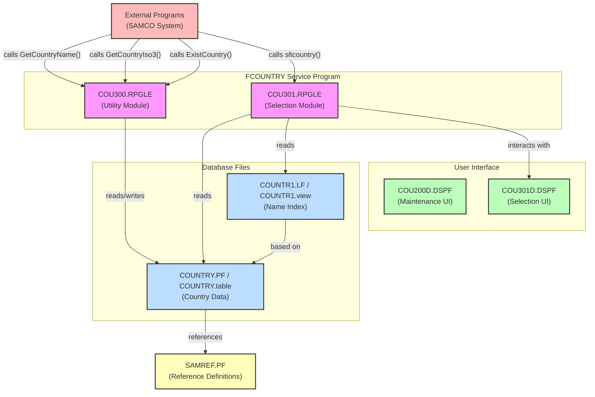

# Country System Analysis

## Overview

The Country System is a component of the SAMCO application that manages country data. It provides functionality for storing, retrieving, and selecting country information. The system consists of database files, display files, and RPG programs that work together to provide a user interface for managing country data.

## Purpose and Business Logic

### Core Purpose

The system serves as a country code management module that:

1. Stores country information (code, name, ISO code)
2. Provides lookup functionality for country codes
3. Allows users to view and edit country information
4. Provides service functions for other modules to access country data

### Business Logic

The business logic is primarily implemented in two RPG modules:

1. **COU300.RPGLE**: Provides utility functions for accessing country data:
   - `GetCountryName`: Retrieves a country name based on country code
   - `GetCountryIso3`: Retrieves the ISO-3 code for a country
   - `ExistCountry`: Checks if a country code exists
   - Internal functions for database operations (chain, close)

2. **COU301.RPGLE**: Implements a country code selection interface:
   - `sltcountry`: Main procedure that displays a selection window
   - Allows searching by code or description
   - Supports pagination for large country lists
   - Returns the selected country code

## User Interface

The system provides two main user interfaces:

### 1. Country Maintenance (COU200D.DSPF)

This display file provides a work-with-style interface for managing country records:

- List view showing country codes, names, and ISO codes
- Option column for selecting actions (2=Edit)
- Function keys for navigation (F3=Exit, F12=Cancel)
- Edit screen for modifying country details

### 2. Country Selection (COU301D.DSPF)

This display file provides a popup window for selecting a country:

- List view showing country codes and names
- Option column for selection (1=Select)
- Search capability by code or description (F8 toggles between modes)
- Function keys for navigation (F3=Exit, F12=Cancel)

Both interfaces use subfile processing for displaying lists of countries and handling user input.

## Database Structure

### Physical File (COUNTRY.PF)

The main table storing country information:

- **COID**: Country code (3 characters) - Primary Key
- **COUNTR**: Country name (30 characters)
- **COISO**: ISO country code (3 characters)

### Logical File (COUNTR1.LF)

A view of the COUNTRY file with an alternate access path:

- Same fields as COUNTRY.PF
- Keyed by COUNTR (country name) for alphabetical access

## Architecture and Dependencies

### Build Dependencies

The system is built with the following components:

1. **Database Files**:
   - COUNTRY.PF (physical file) - Converted to COUNTRY.table
   - COUNTR1.LF (logical file) - Converted to COUNTR1.view

2. **Display Files**:
   - COU200D.DSPF - Country maintenance interface
   - COU301D.DSPF - Country selection interface

3. **RPG Modules**:
   - COU300.RPGLE - Country utility functions
   - COU301.RPGLE - Country selection implementation

4. **Service Program**:
   - FCOUNTRY.ILESRVPGM - Packages the RPG modules into a service program

### Caller/Callee Relationships

- Other programs in the SAMCO system can call the exported procedures from the FCOUNTRY service program:
  - `GetCountryName`
  - `GetCountryIso3`
  - `ExistCountry`
  - `sltcountry`

- The RPG modules access the database files:
  - COU300.RPGLE reads from COUNTRY.PF
  - COU301.RPGLE reads from both COUNTRY.PF and COUNTR1.LF

- COU301.RPGLE interacts with the COU301D display file for user interface

## Potential Improvements

### Database Structure

1. **Normalization**: The current structure is already well-normalized, but could benefit from:
   - Adding additional country attributes (continent, capital, etc.)
   - Adding validation constraints for ISO codes

2. **Indexing**: Consider additional indexes for performance optimization:
   - Index on COISO for ISO code lookups

### Code Structure

1. **Modernization**:
   - Convert from fixed-format RPG to fully free-format RPG
   - Use SQL for database access instead of native I/O
   - Implement error handling with %ERROR and MONITOR groups

2. **Modularization**:
   - Separate UI logic from business logic more clearly
   - Create data access layer separate from business logic

### User Interface

1. **Enhanced Features**:
   - Add filtering capabilities
   - Implement sorting options
   - Add search functionality

2. **Modern UI**:
   - Convert to web interface
   - Implement responsive design
   - Add auto-complete for country selection

### Documentation

1. **Inline Documentation**:
   - Add more comprehensive comments
   - Document parameter usage and return values

2. **External Documentation**:
   - Create API documentation for service program procedures
   - Document database schema and relationships

## Conclusion

The Country System is a well-structured component that provides essential country data management functionality. The conversion from DDS to DDL format for the database files is a positive step toward modernization. Further improvements could focus on modernizing the RPG code, enhancing the user interface, and expanding the functionality to meet evolving business needs.